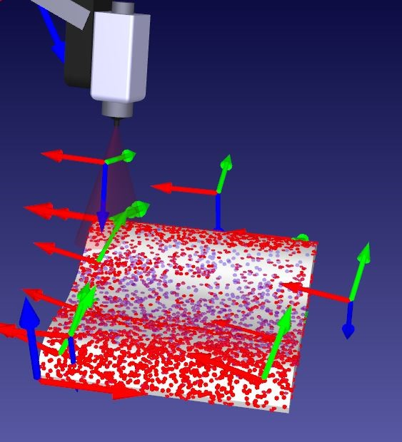

# MECHA470- Mobile Sanitation Robot
### MECHA 470 Robotics Project

-------------------------------------------------------------------------------------

Mobile Sanitation Robot

Project Members:
TaylorAnne Brown - 
Maryam Nassar -
Juan Ruiz -
Daniel Sousa 
      
 

-------------------------------------------------------------------------------------

  

   <h4> California State University Chico</h4>
   <h4> College of Engineering, Computer Science, and Construction Management</h4> 
   <h4> MECA 470 Introduction to Robotics</h4> 
   <h4> Mobile Sanitation Robot</h4> 

#### Table of Contents
- [1. Introduction](#1-Introduction)
- [2. Mobile Robot Degrees of Freedom (dof)](#2-Mobile-Robot-Degrees-of-Freedom)
- [3. Mapping and Path Planning with ROS](#3-Mapping-and-Path-Planning-with-ROS) 
- [4. Coppelia Simulation](#4-Coppelia-Simulation)
- [5. UV Sanitization](#5-UV-Sanitization) 
- [6. Appendix](#6-Appendix)
- [7. References](#7-References)

## 1. Introduction 
The objective of this project is to develop the necessary skills for an autonomous mobile robot that uses UV light to sanitize its surroundings. The scope of this projcet included building a functional simulation using CoppeliaSim and ROS, reseraching the most effective potential UV light bulbs for our application, and a kinematic analysis to determine the degrees of freedom for the mobile robot. 

## 2. Mobile Robot Degrees of Freedom (dof)

The Magni mobile robot operates using a non-holonomic (meaning that its state depends on the path taken in order to achieve) differential drive system in the two front tires. As a differential drive mobile robot it has 3 degrees of freedom: X and Y directions (translational) and around the Z axis (rotational). 

When calculating the degrees of freedom for the mobile robot it was useful to reference Chapter 2 of our Modern Robotics textbook [1]. Chapter 2 Section 1 explains the procedure for finding the dof of a rigid body in 3 dimensional space based on its configuration. Specifically finding the dof of our mobile robot can be compared to the mathematical proof of finding the dof of a coin laying on a flat surface. For example the configuration of the coin can be described using two coordinates (x,y), additionally theta can be used to describe the orientation of the coin. Shown below is the mathematical proof for the 3 dof on the coin. 

  

                                                                                 
As previously states this proof also applies to the dof for the differential drive mobile robot as it has two translational degrees of freedom and one rotational degree of freedom. 

## 3. Mapping and Path Planning with ROS 

Like the Sharq IQ robot, the magni robot will follow a similar navigation and path planning. The robot uses the exising ROS navigation stack to help guide and drive the robot. Depending on the area/place the robot will sanitize, an existing map of the area is needed so the map_server package is able to map the area. The move_base package allows for the magni robot to navigate the area while the sensors are continuously relaying information so the robot never collides with anything. 

 

  

    

<!--

// 

-->

  

This transfer function allows us to model the system in Simulink, and enables us to better visualize the system response.

  

  

</img>

     

  

  

## 4. Coppelia Simulation 

The Magni mobile robot was modeled using CoppeliaSim. An illustration of the simulation in addition to the Lua code are both provided below. The CoppeliaSim file for the Magni robot is provided in the project repository. 

       function sysCall_init()
            left_wheel=sim.getObjectHandle('Magni_LeftMotor')
            right_wheel=sim.getObjectHandle('Magni_RightMotor')
             xml = [[
                         <ui title="Speed Control" closeable="true" resizable="false" activate="false">
                         <group layout="form" flat="true">
                         <label text="Left Wheel (rad/s): 0.00" id="1"/>
                         <hslider tick-position="above" tick-interval="1" minimum="-10" maximum="10" on-change="actuateLeft" id="2"/>
                  <label text="Right Wheel (rad/s): 0.00" id="3"/>
        <hslider tick-position="above" tick-interval="1" minimum="-10" maximum="10" on-change="actuateRight" id="4"/>
    </group>
    <label text="" style="* {margin-left: 400px;}"/>
      </ui>
      ]]
        ui=simUI.create(xml)
    end
    
    function actuateLeft(ui,id,newVal)
            local val = 0.5*newVal
            sim.setJointTargetVelocity(left_wheel,val)
            simUI.setLabelText(ui,1,string.format("Left Wheel (rad/s): %.2f",val))
      end

     function actuateRight(ui,id,newVal)
            local val = 0.5*newVal
            sim.setJointTargetVelocity(right_wheel,val)
            simUI.setLabelText(ui,3,string.format("Right Wheel (rad/s): %.2f",val))
      end

## 5. UV Sanitization 

It has been known that UV light is a mutagen at the cellular level for over 100 years. The 1903 Nobel Prize for Medicine was awarded to Niels Finsen for his use of UV against tuberculosis of the skin. UVC or Germicidal Ultraviolet lights are known to be able to inactivate the COVID-19 virus. The study "Effectiveness of 222-nm ultraviolet light on disinfecting SARS-CoV-2 surface contamination" [2] found that using a 222 nm UVC lamp at an intensity of 0.1 mW/cm2 (24cm away from a surface) can sanitize a surface to undetectable levels (99.7% reduction) from SARS-CoV-2(COVID-19) within 30 seconds. 

For this project a 254nm low ozone STER-L-RAY ® Amalgam Germicidal Ultraviolet (UV-C) Lamps will be used due to their reasonably priced bulbs at $66 each https://www.buyultraviolet.com/ultraviolet-lamps-uv-bulbs-gph436t5l-05-1097-r

 
 
 
 
The 254 nm light damages the viral deoxyribonucleic acid (DNA) or ribonucleic acid (RNA) so that the virus cannot reproduce. According to the International Ultraviolet association and the CDC, due to the COVID-19 virus being relatively new there is not yet a specific deactivation dosage. The dosage for similar viruses in the same family need a dose of 10-20mJ/cm2 to achieve 99.9% disinfection in lab settings. In real life applications the virus is often hidden or shaded from direct UVC light which in turn reduces the UVCs effectiveness. Therefore, to ensure 99.9% deactivation researchers recommend a dosage of 1,000-3,000 mJ/cm2.

To determine the intensity a 254nm UVC lamp produces a UVC detector is required. Once the intensity of the UVC lamp is known we can use the following equation to determine the minimum time needed to sanitize the area of COVID-19. 

UV Dose = UV Intensity (μW/cm2) x Exposure Time (seconds)

The inverse square law applies to germicidal ultraviolet as it does to light: the killing power decreases as the distance from the lamps increases. So we can tell how the intensity of the UV-C lamp disperses further away from the bulb itself and can be mapped in an exponential form. 

The light intensity’s behavior can be modeled using RoboDK’s Paint gun tool. With the use of the included Painting Tutorial file, a small portion of the beam’s intensity can be modeled. This tutorial will resemble the figure below.

 
 
 
Although the tutorial does not resemble the Magni robot, the SprayOn Python code provides a good starting point. Editing the aforementioned Python script in the program allows the user to change the spray colors depending on the intensity. Also, the spray pattern’s shape can be changed in this script. The section of code which accomplishes the latter can be seen below.

 
 
 
As mentioned in the script’s comments, the colors can be adjusted based on the desired RGBA value. More importantly is the matrix which creates the spray pattern shape. The parameters for the shape include several matrices which indicate the farthest and closest points, relative to the gun’s frame. This section of code will need to be adjusted so that the spray pattern models the light intensity’s shape. Once, this is achieved, the simulation will resemble the figure below.

 
 
 
As you can see in the figure above, the red dots represent the areas where the intensity is the largest, and the blue dots represent the inverse. This simulation can highlight areas that will require either more time near the light, or for the robot to get closer.

## 6. Appendix

A1: Degree of Freedom Calculation: 
https://modernrobotics.northwestern.edu/nu-gm-book-resource/2-2-degrees-of-freedom-of-a-robot/

A2: Magni Mobile Robot Information: 
https://www.roboticsbusinessreview.com/robotic-company/directory/listings/ubiquity-robotics/

## 7. References

[1] Lynch, K., &amp; Park, F. C. (2019). Modern robotics: Mechanics, planning, and control. Cambridge, United Kingdom: Cambridge University Press.

[2] Kitagawa, Hiroki, et al. "Effectiveness of 222-nm ultraviolet light on disinfecting SARS-CoV-2 surface contamination." American journal of infection control (2020).

<a href="https://github.com/janso2000/MECHA470_Mobile_Sanitation_Robot"> Click here to go to our project repository </a>
